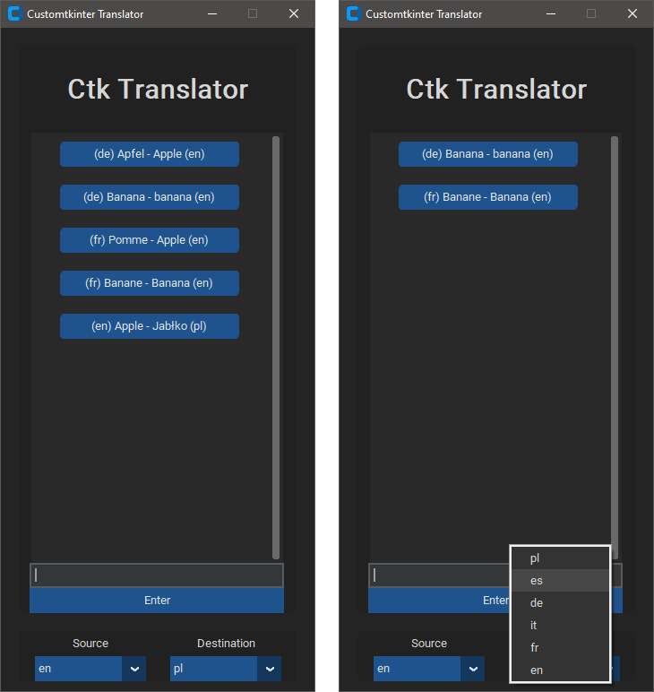

# Customtkinter-Translator
Language translator made in Python using customtkinter and googletrans libraries.<br>
It basically translates a word and saves it in visible library as {source - destination}.<br>
You can delete items from library by clicking them. Library is saved in json file, so it reloads previous translations.

<p align="left"></p>

## Language
Default source language is English and destination is Polish.<br>
I didn't implement changing it in app, so you have to do this in code in translate section.
```
if to_translate:
    # Default source is English and destination is Polish
    # Use language codes like en/pl/de/fr in src="en", dest="pl"
    translated = translator.translate(text=to_translate, src="en", dest="pl")
```

## Python Pip
<ul>
<li>pip install customtkinter</li>
<li>pip install googletrans==3.1.0a0</li>
</ul>
